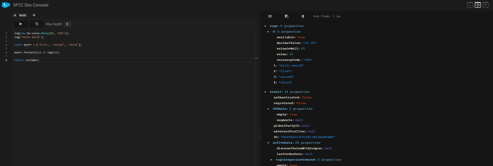

Dev Console
===

> A Salesforce Commerce Cloud (Demandware) Cartridge for Developers.

## Features

- [X] Execute Server Side JavaScript on your Sandbox in your favorite browser
- [X] Adds a global `log` method to allow logging without your code
- [X] No Site Preferences or Misc Imports Required, just drop in and go
- [X] Safety Measures to prevent running in Production Environments
- [X] Menu in the Business Manager (with role management)

Example use of the `log` feature build into the dev console

Installation
---

1. Create a new cartridge folder in your codebase called `sfcc_dev_console`. (If you already have a previous version of this cartridge installed, it would be best to delete your existing `sfcc_dev_console` directory and start over).
2. Copy the `cartridge` folder from this repo into your `sfcc_dev_console` directory and upload the cartridge to your instance.
3. Add `sfcc_dev_console` to Business Manager Storefront `Cartridges` Path
3. Once installed, you can access the Dev Console on your sandbox at `/on/demandware.store/YOUR_SITE_ID/default/Console-Show` ( change `YOUR_SITE_ID` to your Site ID, e.g. `Sites-Site` ).

Business Manager
---

To make use of the Dev Console in the context of the Business Manager (jobs, business manager modules) do the following:

1. Add `sfcc_dev_console` to project or global .gitignore
2. Add `sfcc_dev_console` to the Business Manager `Cartridges` Path, do the following actions to accomplish this:
    * `Administration`
    * `Manage Sites`
    *  On this page click `Mange the Business Manager site`
    *  Go to the tab `Settings`
    *  Add `sfcc_dev_console` to the cartridges path
3. Do the following actions in the Business Manager:
    * `Administration`
    * `Roles & Permissions`
    *  Click on your role
    * `Business Manager Modules`
    *  Assign rights here (Both on `Organization` level & the `Sites` you want to use this on)
4. To get the link `Console (Storefront)` to work, you need to assign the `sfcc_dev_console` cartridge to your Storefront site by following the steps in the Storefront installation guide.
    

    After configuration in the Business Manager you should see a new menu item in the `Administrator` & `Merchant Tools` menu.

    

Use cases
---
### Storefront

* Execute code using your storefront session
* View objects from the current customer session
* Iterate through objects and use the global `log` method to print those logs to the console

### Business Manager

* Execute code using your Business Manager session
* Execute code as if it is a Business Manager Page
* Execute code in the same context as Jobs

Troubleshooting
---
#### I am unable to load the console

You may need to temporarily switch Code Versions, then switch back to trigger the update in Business Manager.

#### I am unable to see the Business Manager modules in the Roles & Permissions

You may need to temporarily switch Code Versions, then switch back to trigger the update in Business Manager.

#### I clicked the link Console (Storefront), but I am getting a 404 page

In order for this link to work you need to follow the Storefront installation steps.

#### I am getting errors when trying to run code through the dev console.

You may need to clear your browsers localStorage due to data structure changes with the new tabs feature.

Sandbox Security
---

> Our `sfcc_dev_console` cartridge will allow anyone with access to your sandbox to be able to run code.

If you wish to lock down your sandbox, SFCC already provides a solution to protect it.

1. Head over to `Administration > Sites > Manage Sites`
2. Select your Site Name under `Storefront Sites`
3. Click the `Site Status` tab
4. Set `Select the Site Status` to `Online (Protected)`
5. Enter a `Password` and click `Apply`

Once this is set up, anytime you login to your storefront from a new browser, you will need to enter the username `storefront` and the password you just created. Your login info will be saved as long as you do not clear your browser's cookies. The Chrome plugin [Demandware with Ease](https://chrome.google.com/webstore/detail/demandware-with-ease/ffhabonelknmejmdnekedmijlhebpcio) provides the ability to automatically login with a Storefront Password.
